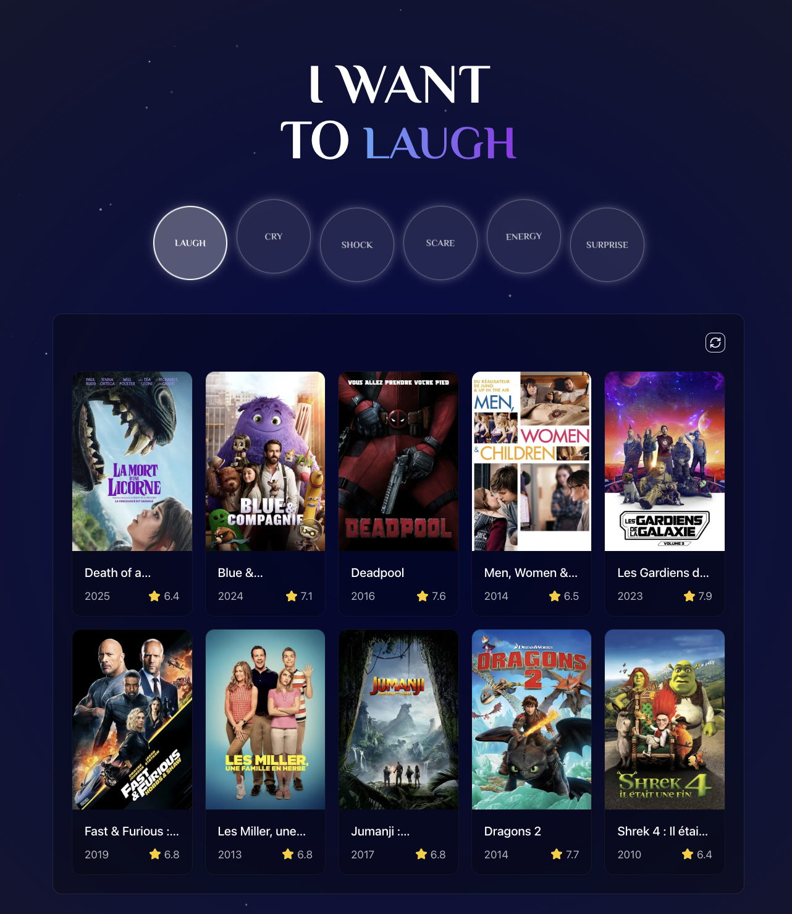

# 🎬 MoodMovie

MoodMovie is a web application that helps you discover films matching your current mood. No more spending hours searching for what to watch - let your emotional state guide your cinematic choices!



## 🌟 Features

- **Mood-based selection**: Find movies based on 5 fundamental emotions (joy, sadness, fear, anger, surprise)
- **Detailed information**: Discover ratings, genres, and synopsis for each film
- **Where to watch**: Access streaming platforms where the movie is available
- **Intuitive interface**: Responsive and modern design for an optimal user experience

## 🛠️ Technologies Used

- **Framework**: [Next.js 14](https://nextjs.org/) (React)
- **Styling**: [Tailwind CSS](https://tailwindcss.com/) with [Shadcn UI](https://ui.shadcn.com/)
- **Data API**: [The Movie Database (TMDB)](https://www.themoviedb.org/)
- **Deployment**: [Vercel](https://vercel.com/)

## 🚀 Installation and Usage

### Prerequisites
- Node.js 18.17.0 or later
- A TMDB API key (obtained from [themoviedb.org](https://www.themoviedb.org/settings/api))

### Installation

1. Clone this repository
   ```bash
   git clone https://github.com/yourusername/moodmovie.git
   cd moodmovie
   ```

2. Install dependencies
   ```bash
   npm install
   ```

3. Create a `.env.local` file at the root of the project with your TMDB API key
   ```
   TMDB_API_KEY=your_api_key_here
   NEXT_PUBLIC_TMDB_API_URL=https://api.themoviedb.org/3
   ```

4. Start the development server
   ```bash
   npm run dev
   ```

5. Open [http://localhost:3000](http://localhost:3000) in your browser

## 🌐 Deployment

The application is configured to be easily deployed on Vercel:
1. Connect your GitHub account to Vercel
2. Import this repository
3. Configure the environment variables (TMDB_API_KEY)
4. Deploy!

## 🤝 Contributions

Contributions are welcome! Feel free to open an issue or submit a pull request.

## 📝 License

This project is licensed under the MIT License - see the [LICENSE](LICENSE) file for details.

## 🙏 Credits

- Developed by [Aladin Akkari](https://aladinakkari.ca)
- This product uses the TMDB API but is not endorsed or certified by TMDB.
- [TMDB Logo](https://www.themoviedb.org/about/logos-attribution)